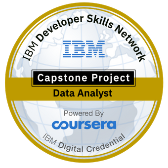

[![LinkedIn][linkedin-shield]][linkedin-url]

<!-- PROJECT LOGO -->
 

  

<h3 align="center">IBM Data Analyst Capstone Project</h3>

  

    Stack Overflow Popular Technology Trends Analysis (2019)
     
     
    -----------------------------------------------
     
     
    <a href="https://dataplatform.cloud.ibm.com/dashboards/abf64179-88a5-40f3-a09a-745cab6f1d7e/view/0034ff1d34ea0ff368eccce4079c2f037f62265ae0bb8052828c7b495c342397a96c4195c8294c5bd2180565a7e9145dc1">View Dashboard</a>
    ·
    <a href="https://github.com/ArfatMateen/REPO_NAME/FILE_NAME">Full Report</a>
  

 

<!-- TABLE OF CONTENTS -->

  
Table of Contents

  <ol>
    <li>
      <a href="#about-the-project">About The Project</a>
      <ul>
        <li><a href="#built-with">Built With</a></li>
      </ul>
    </li>
    <li>
      <a href="#analysis-process">Analysis Process</a>
      <ul>
        <li><a href="#survey-dataset-exploration">Survey Dataset Exploration</a></li>
        <li><a href="#data-collection">Data Collection</a></li>
        <li><a href="#data-wrangling">Data Wrangling</a></li>
        <li><a href="#exploratory-data-analysis">Exploratory Data Analysis</a></li>
        <li><a href="#data-visualization">Data Visualization</a></li>
      </ul>
    </li>
    <li><a href="#dashboard">Dashboard</a></li>
    <li>
      <a href="#findings-and-implications">Findings and Implications</a>
      <ul>
        <li><a href="#programming-language-trends">Programming Language Trends</a></li>
        <li><a href="#database-trends">Database Trends</a></li>
        <li><a href="#overall-trends">Overall Trends</a></li>
      </ul>
    </li>
    <li><a href="#conclusion">Conclusion</a></li>
    <li><a href="#acknowledgments">Acknowledgments</a></li>
  </ol>

 

<!-- ABOUT THE PROJECT -->

# About The Project

The project is based on a Stack Overflow developer survey of the year 2019 which describes popular trends in technology all over the world and provides the findings and implications of the current and future trends in programming languages, databases, platform usage and web frameworks. The project also analyses the demographics of survey respondents based on gender, location, age and formal education level.

<!-- [![Product Name Screen Shot][product-screenshot]](https://example.com) -->

(<a href="#top">back to top</a>)

## Built With

-   [Python](https://www.python.org/)
-   [Jupyter Notebook](https://jupyter.org/)
-   [IBM Watson Studio](https://cloud.ibm.com/)
-   [IBM Cognos Analytics](https://cloud.ibm.com/)
-   [Microsoft Excel](https://office.live.com/start/excel.aspx)

(<a href="#top">back to top</a>)

<!-- ANALYSIS PROCESS -->

# Analysis Process

## Methodology

<ul>
  <li>Data Sources used for analysis:</li>

-   [Stack overflow developer survey 2019](https://cf-courses-data.s3.us.cloud-object-storage.appdomain.cloud/IBM-DA0321EN-SkillsNetwork/LargeData/m1_survey_data.csv)
-   [Job Posting Data using API](https://github.com/ArfatMateen/REPO_NAME/FILE_PATH)
-   [Popular Languages Data using Web Scraping](https://cf-courses-data.s3.us.cloud-object-storage.appdomain.cloud/IBM-DA0321EN-SkillsNetwork/labs/datasets/Programming_Languages.html)

  <li>Data Wrangling & Exploratory Data Analysis:</li>

-   Python (Pandas, Numpy, Matplotlib, Seaborn)
-   Jupyter Notebook

  <li>Data Visualization & Dashboarding:</li>

-   IBM Cognos Analytics
-   Microsoft Excel
</ul>

(<a href="#top">back to top</a>)

## Survey Dataset Exploration

The Stack Overflow survey dataset consists of `11,552` records and `85` columns, which contain both dimension & measure columns.

![Survey Data][dataset-exploration]

(<a href="#top">back to top</a>)

## Data Collection

There are three different data sources which are used in this project.

<ol>
  <li>
    Stack Overflow survey data is available as a csv file which was acquired by using Pandas read_csv function call and providing the url directly in the call.
  </li>
  <li>
    Job posting data was acquired by using the Python request library to get access to the Jobs API, which is available as a flask application in the project, and the data was saved as an Excel Workbook.
  </li>
  <li>
    Popular programming languages data was scraped using Python request & Beautiful Soup library and the data was saved as a csv file.
  </li>
</ol>

(<a href="#top">back to top</a>)

## Data Wrangling

<ul>
  <li>Identified duplicated values in the dataset.</li>
  <li>Removed duplicated values from the dataset.</li>
  <li>Identified missing values in the dataset.</li>
  <li>Imputed missing values in the dataset.</li>
  <li>Normalized data in the dataset.</li>
</ul>

(<a href="#top">back to top</a>)

## Exploratory Data Analysis

<ul>
  <li>Identified the distribution of data in the dataset.</li>
  <li>Identified outliers in the dataset.</li>
  <li>Removed outliers from the dataset.</li>
  <li>Identified correlation between features in the dataset.</li>
</ul>

(<a href="#top">back to top</a>)

## Data Visualization

<ul>
  <li>Visualized the distribution of data.</li>
  <li>Visualized the relationship between two features.</li>
  <li>Visualized composition of data.</li>
  <li>Visualized comparison of data.</li>
</ul>

(<a href="#top">back to top</a>)

<!-- DASHBOARD -->

# Dashboard

![Dashboard Current][dashboard-current]
![Dashboard Future][dashboard-future]
![Dashboard Demographics][dashboard-demographics]

(<a href="#top">back to top</a>)

# Findings and Implications

## Programming Language Trends

![Programming Language Trends][language-trends]

### Findings:

<ul>
  <li>Java-script is the most in demand & will remain as the highest in demand programming language next year.</li>
  <li>HTML, SQL, Bash & Python are the most demanding languages after Java-Script for this year.</li>
</ul>

### Implications:

<ul>
  <li>In the future, Python will gain more popularity.</li>
  <li>SQL will decrease in demand next year.</li>
  <li>Type-Script will overcome the Bash scripting language in the future.</li>
</ul>

(<a href="#top">back to top</a>)

## Database Trends

![Database Trends][database-trends]

### Findings:

<ul>
  <li>This year, MySQL gained the highest popularity.</li>
  <li>Microsoft SQL Server & PostgreSQL have almost similar demand this year.</li>
  <li>SQLite and MongoDB were also able to make it into the top 5 this year.</li>
</ul>

### Implications:

<ul>
  <li>In the future, PostgreSQL & MongoDB will gain more popularity.</li>
  <li>MySQL will decrease in demand.</li>
  <li>Redis & Elasticsearch will overcome Microsoft SQL Server and SQLite in the future.</li>
</ul>

(<a href="#top">back to top</a>)

## Overall Trends

### Findings:

<ul>
  <li>IT is an ever emerging field and requires new stacks of technology every year or so.</li>
  <li>Java-Script and Web Development technology are in great demand.
</li>
  <li>MySQL had the highest demand this year.</li>
</ul>

### Implications:

<ul>
  <li>Web development tech stack will remain the highest in demand in future.</li>
  <li>In the future, databases like PostgreSQL and MongoDB will overcome MySQL.</li>
</ul>

(<a href="#top">back to top</a>)

<!-- CONCLUSION -->

# Conclusion

Every year new technologies emerge, and businesses adapt these technologies to stay relevant, and thus demand for these technologies changes over time. This year, Java-Script was one of the most demanding languages and will remain at the top next year. However, Type-Script will beat Bash in demand in the future. PostgreSQL will be the highest in demand next year.

(<a href="#top">back to top</a>)

<!-- ACKNOWLEDGMENTS -->

## Acknowledgments

-   [Coursera](https://www.coursera.org/professional-certificates/ibm-data-analyst)
-   [Img Shields](https://shields.io)
-   [Best README Template](https://github.com/othneildrew/Best-README-Template)

(<a href="#top">back to top</a>)

<!-- MARKDOWN LINKS & IMAGES -->
<!-- https://www.markdownguide.org/basic-syntax/#reference-style-links -->

[linkedin-shield]: https://img.shields.io/badge/-LinkedIn-black.svg?style=for-the-badge&logo=linkedin&colorB=555
[linkedin-url]: https://www.linkedin.com/in/arfat-mateen
[dataset-exploration]: images/Dataset_Exploration.png
[dashboard-current]: images/1_Dashboard_Current.png
[dashboard-future]: images/2_Dashboard_Future.png
[dashboard-demographics]: images/3_Dashboard_Demographics.png
[database-trends]: images/Database_Trends.png
[language-trends]: images/Language_Trends.png
